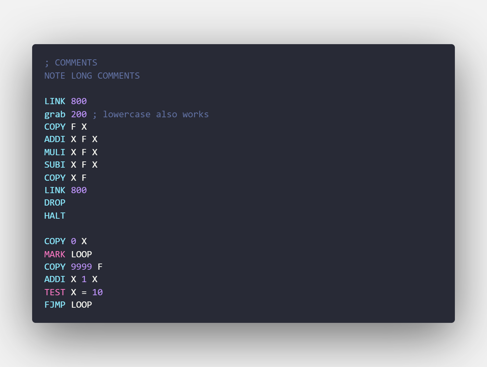

# EXA Syntax Highlighting

Syntax highlighting for programming language EXA from the game [EXAPUNKS](http://www.zachtronics.com/exapunks/) by [Zachtronics](http://www.zachtronics.com/) in [Visual Studio Code](https://code.visualstudio.com/).

## Usage

After installation, the syntax highlighting will automatically activate for files ending in the following extensions:

* `.exa`
* `.exapunks`

## About EXA

EXA is a programming language used to solve puzzles in the game [EXAPUNKS](http://www.zachtronics.com/exapunks/) by [Zachtronics](http://www.zachtronics.com/)

### From the game manual

Keep in mind this is written as if this were documentation for the EXA language from the game universe.

> The EXA virtual machine (EXA-VM) allows many execution agents (EXAs) to execute in a shared network of host computers. Within a network, EXAs can be dynamically created, destroyed, and transferred from one host to another. The EXA-VM enables all EXAs to run independently and simultaneously, even when multiple EXAs are located within the same host.
An EXA's program consists of a series of instructions. Each instruction requires zero or more operands...

## License

Copyright 2018 Jonah Snider

Apache License 2.0
